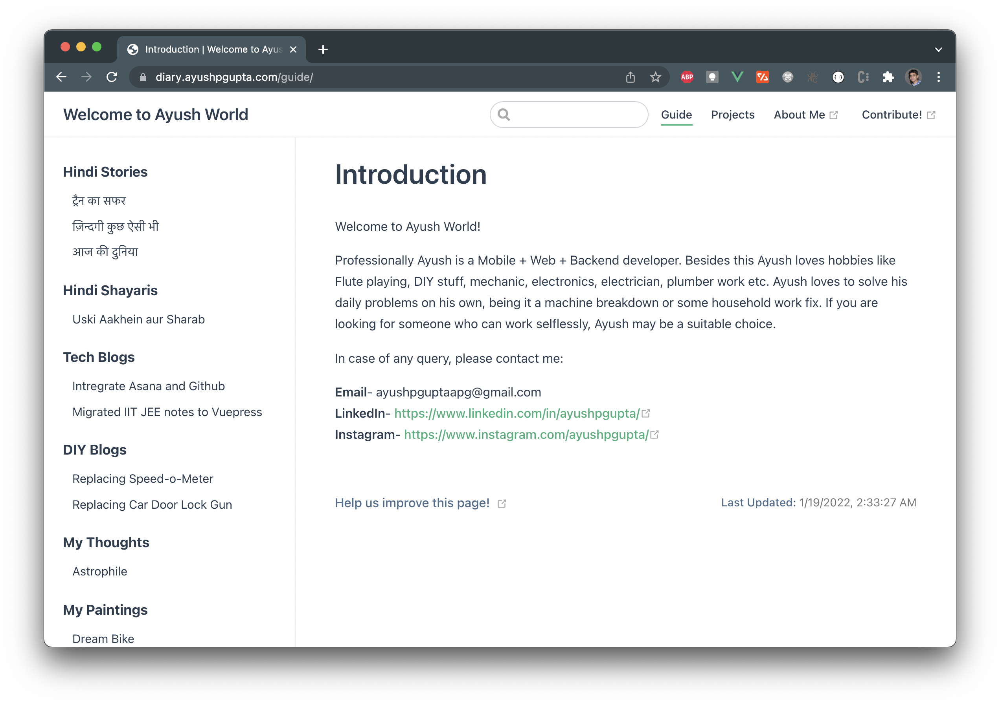

# vuepress-diary

Official Diary of Ayush P Gupta built using VuePress framework.

Live Website: https://diary.ayushpgupta.com/

## Getting Started

1. Clone the repository
2. Navigate to `docs/`
3. Run `npm run dev`
4. Open the localhost link as output in console.

## 👍 Contribution

1. Clone it
2. Create your feature branch (git checkout -b my-new-feature)
3. Commit your changes (git commit -m 'Add some feature')
4. Push to the branch (git push origin my-new-feature)
5. Create new Pull Request

## ✨ Active Contributors

<table>
<tr>
    <td align="center" style="word-wrap: break-word; width: 150.0; height: 150.0">
        <a href=https://github.com/apgapg>
            
             
            <b>Ayush P Gupta</b>
        </a>
    </td>
</tr>
</table>
